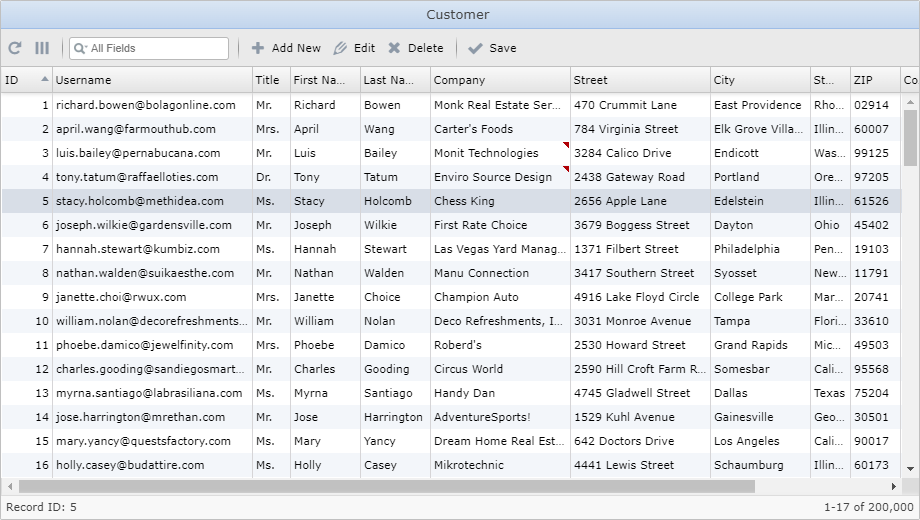

## Screenshots

 
w2grid with 200,000 records.
#
 
Edit a selected record in a modal form.
#
 
Search over all fields.
#
 
Add a new record.
#
 
Delete selected record.
#
 
Select column to sort records.
#
 
Select displayed fields.
#
 
Inline editing fields.
#